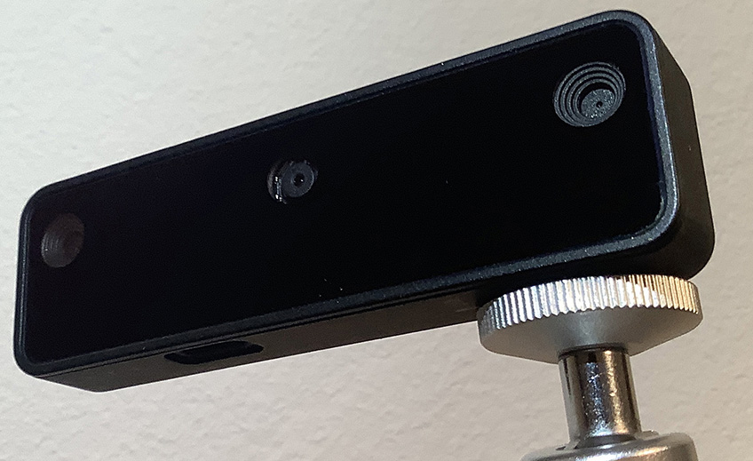
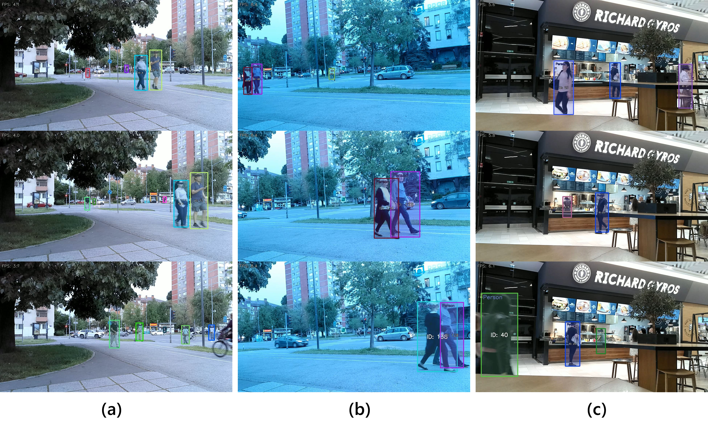
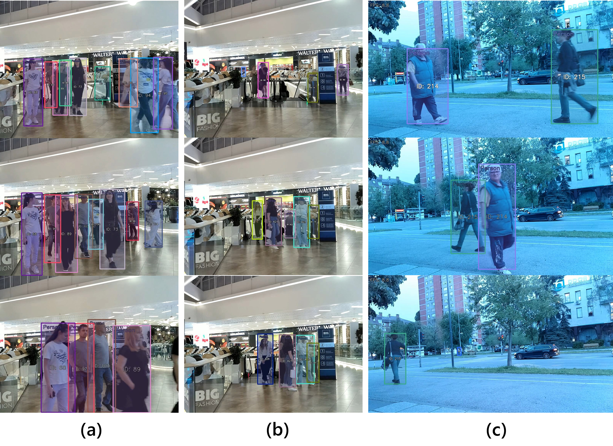

# **personReID**
## **Person detection and re-identification in open-world settings of retail stores and public spaces**
### OpenVINO™, OpenCV, FFmpeg, H.26x, DepthAI-SDK
#### Tested on Oak-D lite

___

✅ _Main characteristics include:_

* **Near real-time demonstration of person re-identification (ReID) task using OAK-D embedded vision platform and OpenVINO™ framework**

* Achieves ~10fps on Intel® Movidius™ Myriad™ X vision processor and OAK-D lite device (uses only color camera)**

*  Based on original project named: "Pedestrian reidentification" (MIT License Copyright (c) 2020 luxonis), original source code: https://github.com/luxonis/depthai-experiments/tree/master/gen2-pedestrian-reidentification

*  Modifications: new functionalities for visualization and control, parallel encoding of input camera feed and output video, recoding of output video with processing results of person re-identification

* Requires the following pre-trained models (https://docs.openvino.ai/archives/index.html):

	1)&nbsp;&nbsp;&nbsp;person-reidentification-retail-0288_openvino_2022.1_6shave

	2)&nbsp;&nbsp;&nbsp;person-detection-retail-0013_openvino_2022.1_6shave

* Hardware encoding of output video streams

* Test experiments: person re-identification in indoor and outdoor spaces under different conditions

###  For more information, please check our conference paper on the link below

📄 Publication preprint available at: 

### Oak-D lite:

 

 

| Feature  | Specification|
|----------|----------|
| Processor | Intel Movidius Myriad X VPU|
| Cameras	| 1x 13 MP (4208 x 3120) RGB (IMX214, rolling shutter)
|		|2x 0.31 MP (640 x 480) mono (OV7251, global shutter)|
| Stereo baseline	| 75 mm|
| AI performance	| 4 TOPS (1.4 TOPS for AI)|
| Video output	| Up to 4K@30fps (H.264/H.265/MJPEG)|
| Depth perception	| Stereo, 300,000-point, 200+ FPS|
| Connectivity	| USB 3.1 Gen1 Type-C|
| Dimensions 	| (WxHxD), 91 mm x 28 mm x 17.5 mm|
| Weight	| 61 g|
| Variants	| Fixed-focus / Auto-focus (RGB cam)|
| Mounting |1/4”-20 tripod, VESA (7.5 cm, M4) |

___

 

# **Examples**

 

 
 

### Results visualization 1:
**(a)** succesful ReID, but with low fps rate due to dynamic background noise; 

**(b)** succesful ReID under low light conditions, but with identity loss after change of person’s orientation at the end of sequence; 

**(c)** retail store application.

___

### Results visualization 2:
**(a)** crowded indoor scene - successful ReID, but with low fps; 

**(b)** false person detection, but with correct ReID; 

**(c)** low light operation.

___

 

# **Test videos**

 

### testVideo1_TreeSequence

▶️ [--->>> personReID_testVideo1_real_fps](./testVideos/testVideo1_TreeSequence/personReID_testVideo1_real_fps.mp4 "personReID_testVideo1_real_fps")

▶️ [--->>> personReID_testVideo1_rec](./testVideos/testVideo1_TreeSequence/personReID_testVideo1_rec.mp4 "personReID_testVideo1_real_fps")

▶️ [--->>> testVideo1_TreeSequence](./testVideos/testVideo1_TreeSequence/unprocessed/testVideo1_TreeSequence.mp4 "testVideo1_TreeSequence")

___

 

### testVideo2_LightSequence

▶️ [--->>> personReID_testVideo2_real_fps](./testVideos/testVideo2_LightSequence/personReID_testVideo2_real_fps.mp4 "personReID_testVideo2_real_fps")

▶️ [--->>> personReID_testVideo2_rec](./testVideos/testVideo2_LightSequence/personReID_testVideo2_rec.mp4 "personReID_testVideo2_real_fps")

▶️ [--->>> testVideo2_LightSequence](./testVideos/testVideo2_LightSequence/unprocessed/testVideo2_LightSequence.mp4 "testVideo2_LightSequence")

___

 

### testVideo3_StoreSequence1

▶️ [--->>> personReID_testVideo3_real_fps](./testVideos/testVideo3_StoreSequence1/personReID_testVideo3_real_fps.mp4 "personReID_testVideo3_real_fps")

▶️ [--->>> personReID_testVideo3_rec](./testVideos/testVideo3_StoreSequence1/personReID_testVideo3_rec.mp4 "personReID_testVideo3_real_fps")

▶️ [--->>> testVideo3_StoreSequence1](./testVideos/testVideo3_StoreSequence1/unprocessed/testVideo3_StoreSequence1.mp4 "testVideo3_StoreSequence1")

___

 

### testVideo4_StoreSequence2

▶️ [--->>> personReID_testVideo4_real_fps](./testVideos/testVideo4_StoreSequence2/personReID_testVideo4_real_fps.mp4 "personReID_testVideo4_real_fps")

▶️ [--->>> personReID_testVideo4_rec](./testVideos/testVideo4_StoreSequence1/personReID_testVideo4_rec.mp4 "personReID_testVideo4_real_fps")

▶️ [--->>> testVideo4_StoreSequence2](./testVideos/testVideo4_StoreSequence2/unprocessed/testVideo4_StoreSequence2.mp4 "testVideo4_StoreSequence2")

___

 

## Licenses:

Presented implementation and experimental results are based on the pre-trained models kindly provided by the [OpenVINO™ project](https://github.com/openvinotoolkit): Open-source toolkit for optimizing and deploying AI inference.
  
The presented test videos were recorded for research purposes during live experiments and are provided under the Creative Commons Attribution-NonCommercial (CC BY-NC) license.
  
**personReID** is released under the MIT License terms in the provided LICENSE file.

___

 

### For more information or if you would like to use some of this content, please consider citing the following paper:

 

[1] *Brkljač, B., Brkljač, M.* (**2025**). **Person detection and re-identification in open-world settings of retail stores and public spaces**. In _Proceedings of the 2nd International Scientific Conference "ALFATECH – Smart Cities and modern technologies - 2025"_, Belgrade, Serbia, Feb. 28, 2025

<pre><code>
    @inproceedings{brkljacPersonReid2025,
    author = {Brklja{\v{c}}, Branko and Brklja{\v{c}}, Milan},
    title = {Person detection and re-identification in open-world settings of retail stores and public spaces},
    booktitle = {Proceedings of the 2\textsuperscript{nd} International Scientific Conference ALFATECH – Smart Cities and modern technologies, Belgrade, Serbia},
    volume = {1},
    pages = {1--7},   
    month = {feb},
    year = {2025},
    doi = {-}
    }
</code></pre>

 

[2] Brkljač, B., Brkljač, M. (**2025**). **Person detection and re-identification in open-world settings of retail stores and public spaces**. arXiv preprint [**arXiv:2505.00772**](https://arxiv.org/abs/2505.00772)

<pre><code>
      @misc{brkljac2025persondetectionreidentificationopenworld,
      title={Person detection and re-identification in open-world settings of retail stores and public spaces}, 
      author={Branko Brkljač and Milan Brkljač},
      year={2025},
      eprint={2505.00772},
      archivePrefix={arXiv},
      primaryClass={cs.CV},
      url={https://arxiv.org/abs/2505.00772},
      doi={10.48550/arXiv.2505.00772}	  
      }
</code></pre>

